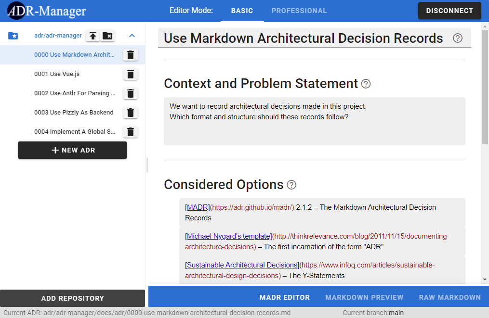

# ADR Manager (web app)

> A web-based application for the efficient creation and management of [architectural decision records (ADRs)](https://adr.github.io) in Markdown (MADR)

This is the `adr-manager` web app package of the [`adr-manager-apps`](../../README.md) monorepo.
For installation, build, test, and release instructions that apply to the whole repository, see the [root README](../../README.md).
This document covers what is specific to the web app.

## Description

[MADR](https://adr.github.io/madr/) is a Markdown template for quickly capturing architectural decisions.
It offers a naming scheme and template to keep the layout of recorded decisions consistent.
Each decision is stored in a separate file.
The web app supports the management of MADRs stored in the folder `docs/adr` in GitHub and GitLab repositories, including self-hosted GitLab instances.

The web app is built with Vue 3, Vite, TypeScript, CodeMirror 6, and a custom token-based design system (no UI framework), and it shares the MADR parser and ADR domain model with the VS Code extension through the [`@adr-manager/core`](../../packages/core) package.

## Quick Start

You can find the tool at <https://adr.github.io/adr-manager-apps/>.

## Supported Browsers

The tool has been successfully tested in Chrome, Firefox, and Opera.

## Usage

1. After opening the tool, connect to GitHub or GitLab. The tool needs your permission to access your repositories and email address.
2. Add a repository. If your account does not have access to a repository with MADRs, you can simply fork one, for example <https://github.com/JabRef/jabref> or <https://github.com/adr/adr-log>.
3. Now you can edit any files in `docs/adr` of the repository.
   Edit existing ADRs or create new ones.
   One of the most important features is the MADR Editor that allows you to quickly draft a MADR while ensuring a consistent format.
   
4. Do not forget to push your changes once you are done with editing the files.

Some technical notes:

- The session tokens and changes to ADRs are stored in local storage.
  That way they are not lost when you reload the page or restart the browser.
  However, changes will be lost when you either
  - clear local storage or
  - press the `Disconnect` button.
- The general idea is that you directly push your changes to GitHub after editing.
- During development, we may remove permissions for the OAuth App from time to time.
  Do not be surprised if you have to give permissions repeatedly.

## Development

Common workflow (install, lint, format, releases) lives in the [root README](../../README.md).
The commands below are run from the repository root and cover what is specific to the web app.

### Dev server

```bash
pnpm dev:web
```

The Vite dev server runs at `http://localhost:8000/adr-manager-apps/` (the `/adr-manager-apps/` base path matches the GitHub Pages deployment).
The main manager route is `http://localhost:8000/adr-manager-apps/#/manager`.

Even when you run it locally, you need to connect to GitHub to use any functionality.
You need a GitHub account with access to a repository that contains MADRs, normally under `docs/adr`.

### End-to-end tests

We use [Cypress](https://www.cypress.io/) for end-to-end testing.
The Cypress tests need the web app dev server running and a valid GitHub OAuth session.
The CI pipeline provides the necessary OAuth `authId` as an environment variable.
Locally you need to provide one yourself.

Run the dev server in one terminal:

```bash
pnpm dev:web
```

Then run the tests with the credentials set as environment variables:

```bash
CYPRESS_OAUTH_E2E_AUTH_ID=<auth-id> CYPRESS_USER=<github-user> pnpm e2e:web
```

Alternatively, create `apps/adr-manager/cypress.env.json` and fill it with the following content:

```json
{
  "OAUTH_E2E_AUTH_ID": "<auth-id>",
  "USER": "<github-user>"
}
```

The value of `OAUTH_E2E_AUTH_ID` and `USER` needs to be a valid `authId` and `user` from an active OAuth session.
To get a local `authId`, sign in through the running web app, open the browser developer tools, and inspect local storage for `http://localhost:8000` (`authId`, `user`).
The involved GitHub account also needs to have developer access to the repo `adr/adr-test-repository-empty`.

### Backend setup (GitHub)

The project uses OAuth for the authentication to GitHub.
If you do not want to use this instance, you can easily set up your own by following these steps:

1. Create an OAuth application on GitHub (see [here](https://docs.github.com/en/github-ae@latest/developers/apps/creating-an-oauth-app)).
   - Copy the Client ID and Client Secret of the app (you will need them later).
2. Create a GitHub app on Firebase and in its configuration set the Client ID and Client Secret as copied from the above GitHub app.

- Set the callback URL in the GitHub OAuth app configuration to the one provided by Firebase.

### GitLab setup

GitLab authentication uses the OAuth authorization code flow with PKCE directly against the GitLab instance, so no Firebase or other backend is involved.
The instance must run **GitLab 15.1 or newer** (older versions reject the browser-side token exchange because the `/oauth/token` endpoint does not answer CORS preflights).

For gitlab.com, the application ID of the hosted deployment is baked into the build.
To use your own, set `VITE_GITLAB_CLIENT_ID` at build time.

For a self-hosted instance, an administrator registers the OAuth application once:

1. In the GitLab Admin Area (or under a group or user profile), go to **Applications** and create a new application.
2. Set the redirect URI to the exact URL where the web app is hosted, including the trailing slash, for example `https://tools.example.com/adr-manager-apps/`.
3. **Uncheck "Confidential"** (the web app is a public client and never sees a secret).
4. Select only the **`api`** scope.
5. Hand the generated application ID to users. They enter it together with the instance base URL behind "Self-hosted instance" on the landing page.

#### Offline / air-gapped use

The GitLab integration works without internet access as long as the GitLab instance is reachable:

- Build the app (`pnpm build`) and serve the `dist/` folder from any static file server on the internal network.
  Set `VITE_BASE_PATH` at build time if it is not served under `/adr-manager-apps/`.
- Register the OAuth application with the internal URL as redirect URI (see above).
- All assets (fonts, icons, scripts) are bundled, and Firebase is only loaded when GitHub sign-in is used, so no requests leave the network.
- If the instance uses a self-signed certificate, the certificate authority must be trusted by the browser or operating system first.
  Hosting the app over plain HTTP also works, but then the OAuth flow falls back to the less secure `plain` PKCE method because browsers only expose SubtleCrypto in secure contexts.

## Project context

The web-based ADR Manager started as an undergraduate research project at the Institute of Software Engineering of the University of Stuttgart, Germany.
It was also submitted to the [ICSE Score Contest 2021](https://conf.researchr.org/home/icse-2021/score-2021).
Since then it has been given over to the [ADR organization on GitHub](https://github.com/adr), where it is maintained and extended.
See the [root README](../../README.md) for the full acknowledgements.
